<!-- Generated from notebook/doc.ipynb by notebook/scripts/readme.py. Edit the notebook, not this file. -->

# Physical AI Current State Overview

ROB 599 · Lecture 2 · Fall 2026. This page is exported from [the notebook](notebook/doc.ipynb), which is the editable, presentable form. Open it with `bash notebook/lab.sh`.

<pre>
<b>understand the field</b>
  <b>§1 what it is</b>         <b>the loop</b> · <b>embodiment</b>
  <b>§2 the anatomy</b>        <b>seven stages</b> · <b>sense</b> · <b>represent</b> · <b>anticipate</b> · <b>decide</b> · <b>act</b> · <b>verify</b>
                        <b>adapt</b>
  <b>§3 toward production</b>  <b>what gets built</b> · <b>the missing part</b> · <b>build on today</b>
<b>join the conversation</b>
  <b>§4 read a paper</b>       <b>PACES</b> · <b>on one paper</b>
  <b>§5 the debates</b>        <b>the format</b> · <b>debate 1</b> · <b>what to read</b> · <b>prompts</b>
  <b>§6 keep the hub alive</b> 
  <b>§7 my research</b>
</pre>

- The top half is the field: what it is, the seven stages people work on, and how far each is from production.
- The bottom half is the skill. Read one paper, argue two, and keep the hub growing after the semester.
- Everything here is in [the hub](https://yayuanli-org.github.io/awesome-physical-ai/). This lecture goes stale, and the hub gets edited.
- Leave knowing which stage to read and search, with enough shared context to prepare a debate.

## What physical AI is

<pre>
          the physical world, objects and the changes they undergo
                    │
              sense │                                       ▲
                    ▼                                       │
        ┌─ <b>model it</b> ───────────────────────┐                │  acting changes the world,
        │   represent ──► anticipate       │                │  so what has to be modeled
        └────────────────┬─────────────────┘                │  changes too
                         │ decide                           │
        ┌─ <b>change it</b> ────▼──────────────────┐               │
        │   act ──► verify ──► adapt        ├───────────────┘
        │   through an embodiment: a        │
        │   person wearing glasses, a       │
        │   robot, or the two together      │
        └───────────────────────────────────┘
</pre>

- The subject is the change. Who carries it is a variable: a person wearing glasses, a robot, or both.
- Model the world, then change it through an embodiment, the hub's word for who moves the atoms. Acting changes the model, so the two close into a loop.
- Every hub paper is tagged with the stages it touches, so the loop can be counted. §2 walks it one stage at a time.

<pre>
<i>where we are</i>
<b>understand the field</b>
  <b>§1 what it is</b>         <b>the loop</b> · embodiment
  §2 the anatomy        seven stages · sense · represent · anticipate · decide · act · verify
                        adapt
  §3 toward production  what gets built · the missing part · build on today
<b>join the conversation</b>
  §4 read a paper       PACES · on one paper
  §5 the debates        the format · debate 1 · what to read · prompts
  §6 keep the hub alive a row, a cell, a column
  §7 my research
</pre>

### Embodiment: who moves the atoms

<pre>
                      <b>a person</b>                     <b>a robot</b>                    <b>the two together</b>
                      ────────                     ───────                    ────────────────
   the AI's job       teach the person to do       do the task itself         share one task
   what it is good    harder tasks than <b>a robot</b>    narrow tasks, full         a couch through
   for today          can do, with <b>a person</b>'s      automation, no one         a doorway. Not in
                      hands and judgment           in the loop                the hub yet
   in the hub         48 papers                    30 papers                  6 papers
</pre>

<table><tr><td valign="top" width="33%">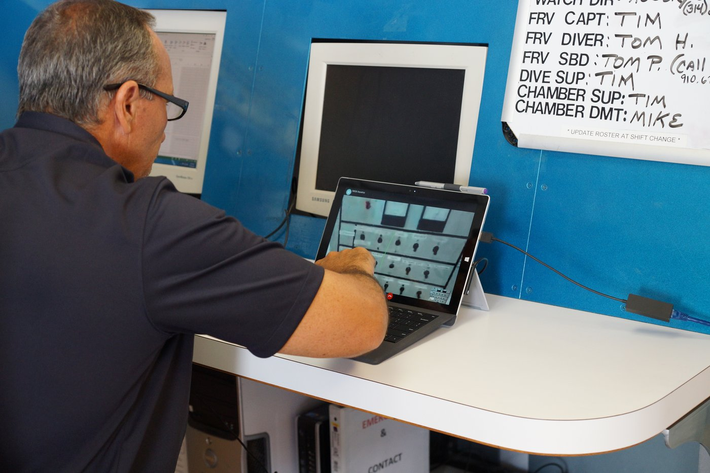</td><td valign="top" width="33%">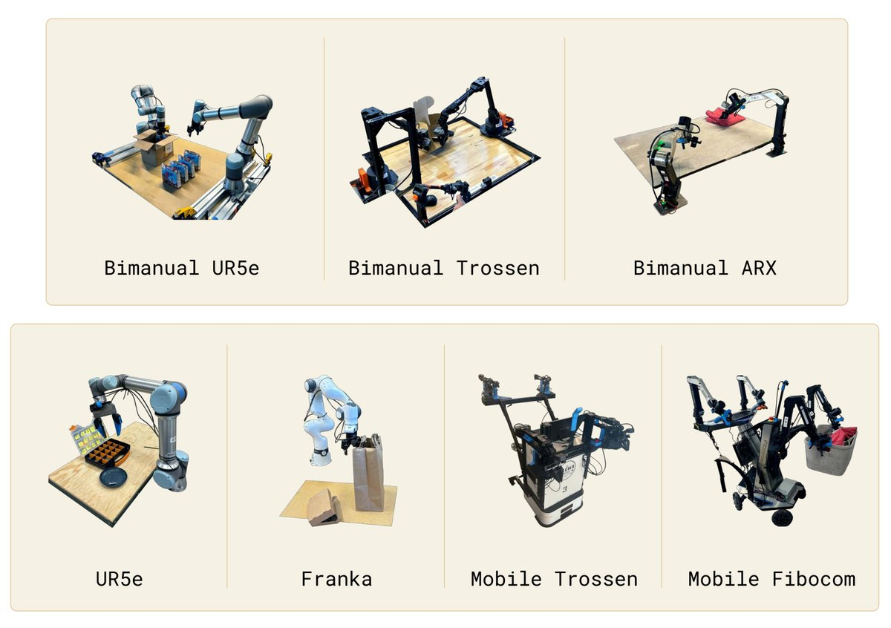</td><td valign="top" width="33%">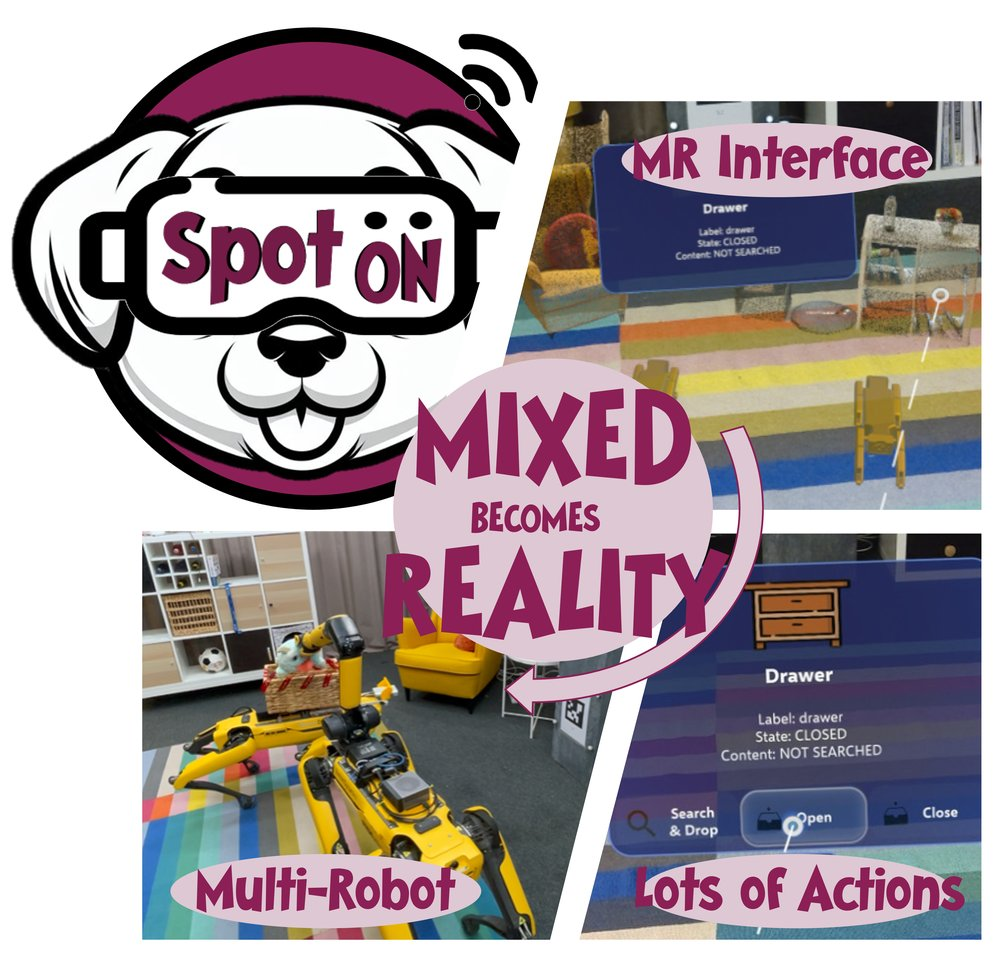</td></tr><tr><td valign="top"><b>A person.</b> An expert at a laptop circles the switch a crew member wearing a headset should flip. NASA NEEMO, 2015.</td><td valign="top"><b>A robot.</b> The seven platforms one π₀ policy drives, from a single arm to a mobile bimanual base. Black et al., 2024.</td><td valign="top"><b>Together.</b> A person in mixed reality directs a team of quadrupeds through doors, drawers and light switches. Spot-On, 2025.</td></tr></table>

- The AI either teaches a person or is the robot. A person brings hands and judgment, and a robot brings full automation on a narrow task.
- People handle harder tasks than robots today, so a human-side system deploys earlier, and its footage trains the robot later. EgoDex, EgoVLA and DexUMI already do this.
- A person and a robot on one task is the smallest branch, 6 of 110 papers, and the one the next decade needs.
- Both embodiments change the world, so every stage in §2 keeps two rows, a person above and a robot below.

<pre>
<i>where we are</i>
<b>understand the field</b>
  <b>§1 what it is</b>         <b>the loop</b> · <b>embodiment</b>
  §2 the anatomy        seven stages · sense · represent · anticipate · decide · act · verify
                        adapt
  §3 toward production  what gets built · the missing part · build on today
<b>join the conversation</b>
  §4 read a paper       PACES · on one paper
  §5 the debates        the format · debate 1 · what to read · prompts
  §6 keep the hub alive a row, a cell, a column
  §7 my research
</pre>

## The anatomy of the field: seven stages

<pre>
          the physical world, objects and the changes they undergo
                    │
          <b>2.1 sense</b> │                                       ▲
                    ▼                                       │
        ┌─ model it ───────────────────────────────┐        │
        │   <b>2.2 represent</b> ──► <b>2.3 anticipate</b>       │        │  the loop of §1, with the
        └────────────────────────┬─────────────────┘        │  stage each subsection
                                 │ <b>2.4 decide</b>               │  walks written onto it
        ┌─ change it ────────────▼─────────────────┐        │
        │   <b>2.5 act</b> ──► <b>2.6 verify</b> ──► <b>2.7 adapt</b>   ├────────┘
        └──────────────────────────────────────────┘
</pre>

- The research topics of the field are the seven stages of the loop in §1. Each gets a subsection: what it is, what people build, where it stands.
- Every subsection keeps the two rows of embodiment, because the same stage is a different problem for a person and for a robot.
- Two stages, 2.6 verify and 2.7 adapt, are where the hub is thinnest, and the lecture ends up there.

<table>
<thead><tr><th>stage</th><th>the question it answers</th><th>papers that live there</th></tr></thead>
<tbody>
<tr><td>2.1 sense</td><td>turn sensors into observations</td><td>SAM 2, HOT3D</td></tr>
<tr><td>2.2 represent</td><td>turn observations into a state you can act on</td><td>DINOv2, 3D Gaussian Splatting</td></tr>
<tr><td>2.3 anticipate</td><td>predict what the world does next</td><td>V-JEPA 2, Genie</td></tr>
<tr><td>2.4 decide</td><td>choose the next step or the plan</td><td>SayCan, VLaMP</td></tr>
<tr><td>2.5 act</td><td>emit the action: a motor command, an instruction, an overlay</td><td>π₀, ShowHowTo</td></tr>
<tr><td>2.6 verify</td><td>check whether the intended change happened</td><td>PREGO, SAFE</td></tr>
<tr><td>2.7 adapt</td><td>change the policy or the model from the outcome</td><td>Every Mistake Counts, Inner Monologue</td></tr>
</tbody></table>

- A paper touches two or three stages as a rule. 81 of the 110 do.
- A vision-language-action policy (camera and instruction in, joint commands out) is sense, decide, act. A task assistant on glasses is sense, decide, act, verify.
- A person skipping a step and a robot policy failing are the same verify stage, and the two literatures barely cite each other.

<pre>
<i>where we are</i>
<b>understand the field</b>
  <b>§1 what it is</b>         <b>the loop</b> · <b>embodiment</b>
  <b>§2 the anatomy</b>        <b>seven stages</b> · sense · represent · anticipate · decide · act · verify
                        adapt
  §3 toward production  what gets built · the missing part · build on today
<b>join the conversation</b>
  §4 read a paper       PACES · on one paper
  §5 the debates        the format · debate 1 · what to read · prompts
  §6 keep the hub alive a row, a cell, a column
  §7 my research
</pre>

### 2.1 Sense: what the hardware sees, and where the signal stops

<b>a person</b>
<table><tr><td valign="top" width="25%">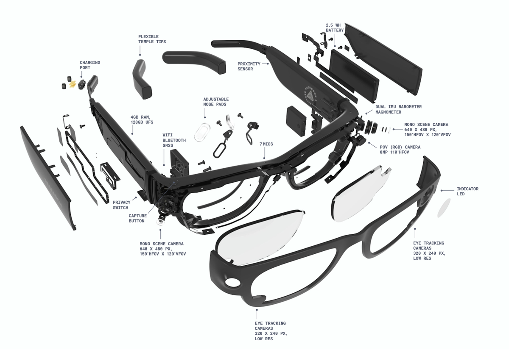</td><td valign="top" width="25%">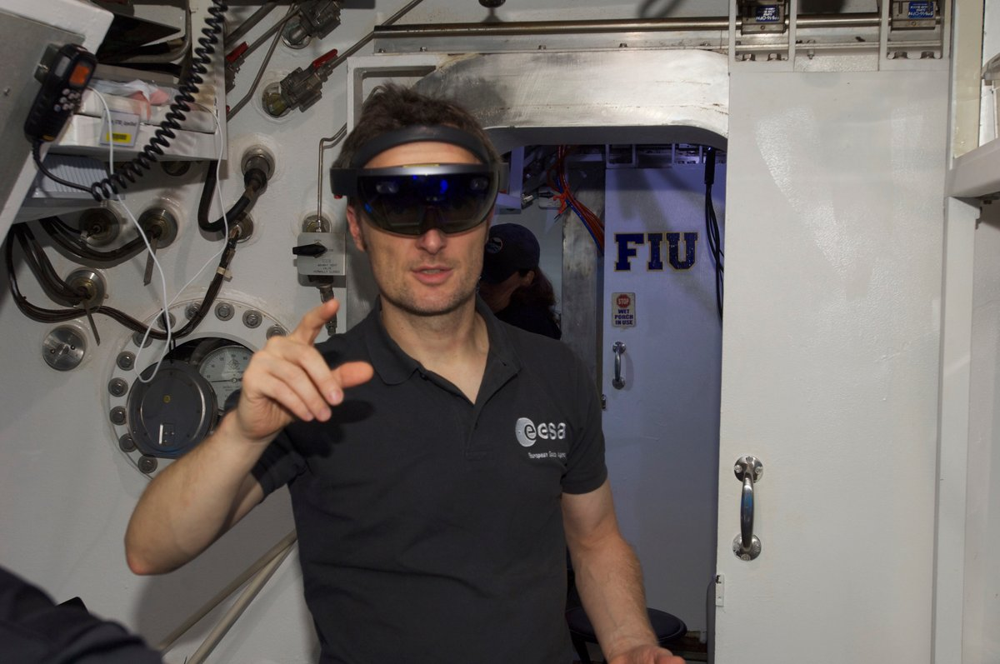</td><td valign="top" width="25%"></td><td valign="top" width="25%">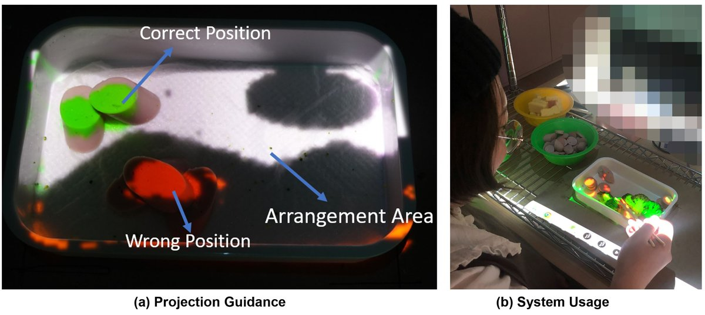</td></tr><tr><td valign="top"><b>Research glasses.</b> Project Aria carries two scene cameras, an RGB camera, two eye cameras, seven microphones and two IMUs. Meta, 2023.</td><td valign="top"><b>A headset with a display.</b> HoloLens adds a depth camera, hand tracking, and holograms drawn in the wearer's view. NASA NEEMO 21.</td><td valign="top"><b>Consumer glasses.</b> Ray-Ban Meta has one camera, microphones and speakers, and since September 2025 a display in the lens, for $799.</td><td valign="top"><b>Projector and camera.</b> The instruction is drawn onto the workspace itself, and no one wears anything. SketchMeHow, 2021.</td></tr></table>

- A camera on the head sees what the person sees. 51 of the 110 papers start from that stream, more than from any other sensor.
- The return channel is the second half of the hardware, a display in the lens, a speaker, or a projector that draws on the table.
- The view is partial, hidden by the hands, and moving. All-day glasses with a display are arriving at consumer prices from three vendors in 2026.

<b>a robot</b>
<table><tr><td valign="top" width="50%">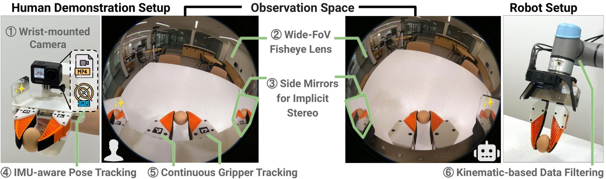</td><td valign="top" width="50%">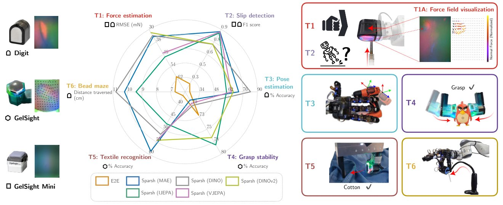</td></tr><tr><td valign="top"><b>A camera on the wrist.</b> UMI's gripper carries a wide-angle camera, side mirrors for stereo and an IMU, and is held by a person or bolted to an arm. Chi et al., 2024.</td><td valign="top"><b>Touch.</b> Vision-based tactile pads (DIGIT, GelSight) film a gel as it deforms. Sparsh learns from 460k such images. Meta, 2024.</td></tr></table>

<table><tr><td valign="top" width="33%">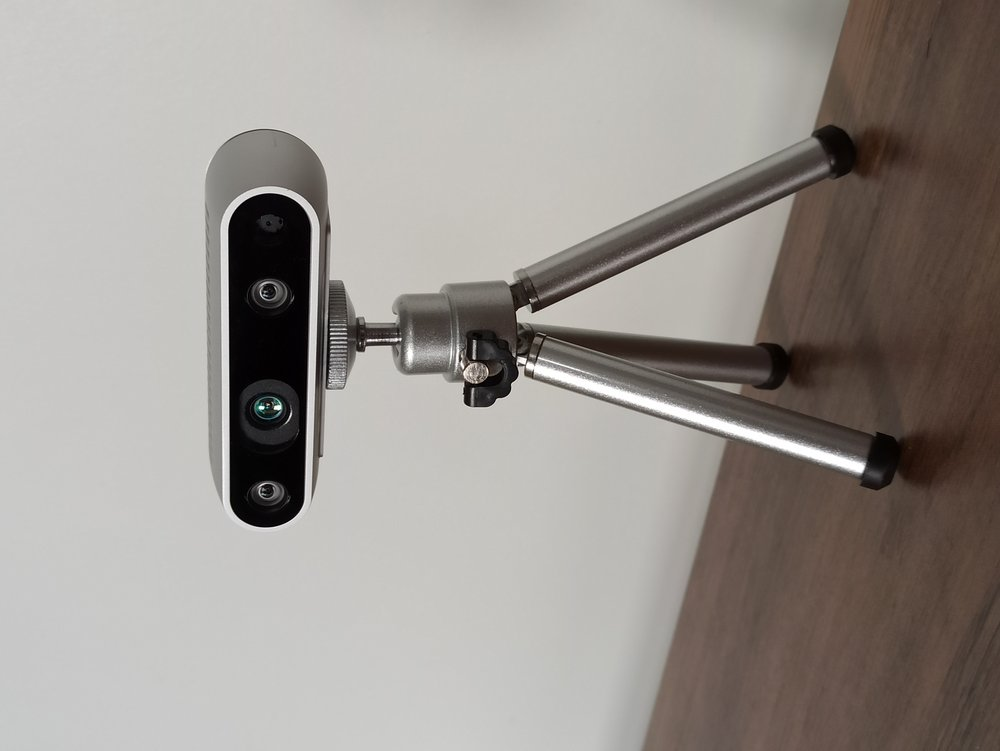</td><td valign="top" width="33%"></td><td valign="top" width="33%">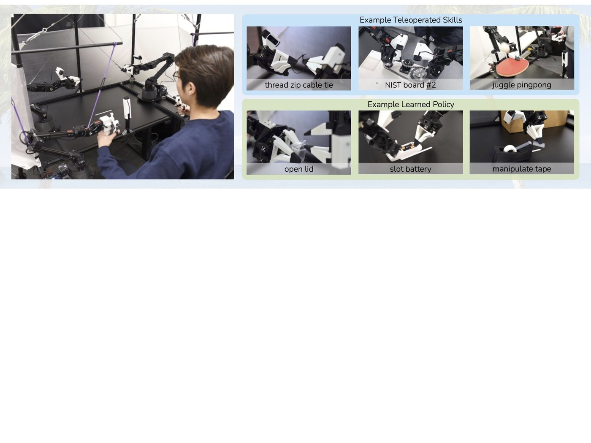</td></tr><tr><td valign="top"><b>Depth.</b> A stereo depth camera returns a point cloud, the usual source of the hub's 3D. Intel RealSense D435.</td><td valign="top"><b>Range.</b> LiDAR sweeps a laser and returns distance, standard on mobile robots and rare on arms. Velodyne.</td><td valign="top"><b>The whole rig.</b> ALOHA puts two cameras over the table and one on each wrist, and a person moves the leader arms to teach it. Zhao et al., 2023.</td></tr></table>

- A robot's cameras sit on the wrist and over the table. Depth and LiDAR add range, and a tactile pad on the fingertip adds contact.
- Touch is where the hub is thinnest. 2 of 110 papers sense it, and 8 hold force, mass or friction in their state.
- Every sensor is calibrated and priced per arm. Hand-held grippers (UMI, DexUMI) are the way around it, because the data arrives with no robot in the room.

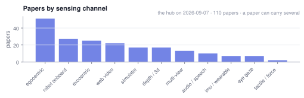

- Cameras dominate on both rows, egocentric first and the robot's own second. Everything that is not a camera is a tenth of the hub or less.
- Simulators and web video count as sensors here, because 39 papers learn from them and never see a real one.

<table><tr><td valign="top" width="50%">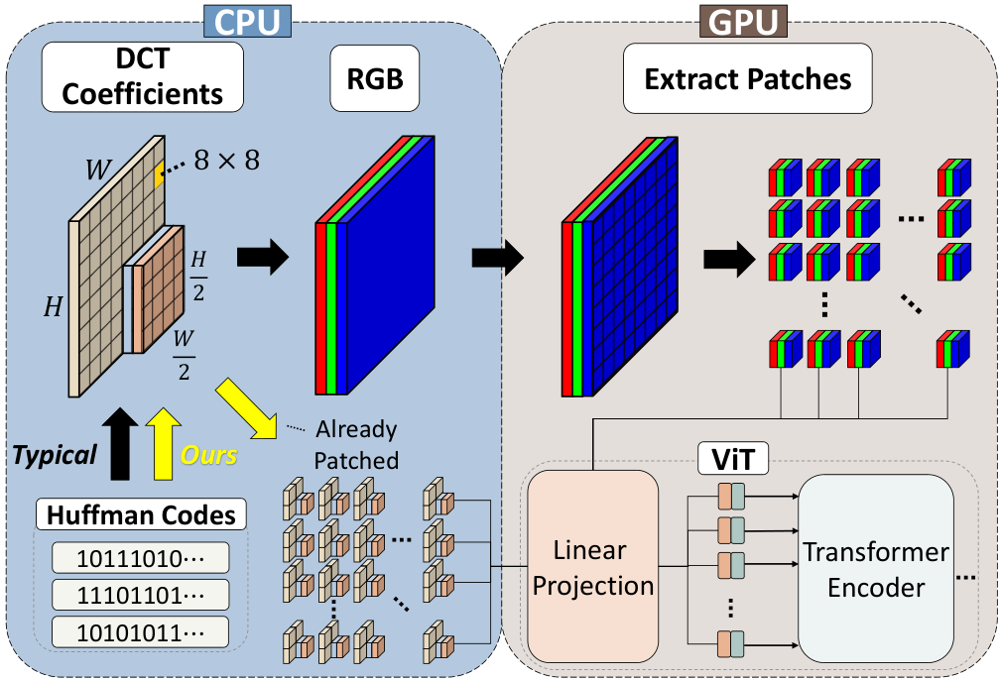</td><td valign="top" width="50%">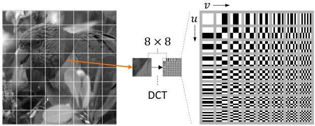</td></tr><tr><td valign="top"><b>Skip the decode.</b> A ViT reads JPEG's DCT coefficients straight off the disk and never sees RGB. Park and Johnson, CVPR 2023.</td><td valign="top"><b>What it reads.</b> The 8×8 frequency blocks JPEG stores are patches already, which is why a transformer takes them and a convnet does not.</td></tr></table>

- From sensing to representing is still research. Where the sensor stops and the representation starts is a design choice, and moving it is a paper.
- RGB no more trains a ViT on the encoded JPEG and gets 39.2% faster training and 17.9% faster inference with no accuracy loss.
- The robot-side twin is Sparsh, touch representations learned from raw tactile images across three sensor types, in place of hand-built force and slip models.

<pre>
<i>where we are</i>
<b>understand the field</b>
  <b>§1 what it is</b>         <b>the loop</b> · <b>embodiment</b>
  <b>§2 the anatomy</b>        <b>seven stages</b> · <b>sense</b> · represent · anticipate · decide · act · verify
                        adapt
  §3 toward production  what gets built · the missing part · build on today
<b>join the conversation</b>
  §4 read a paper       PACES · on one paper
  §5 the debates        the format · debate 1 · what to read · prompts
  §6 keep the hub alive a row, a cell, a column
  §7 my research
</pre>

### 2.2 Represent: there is no best representation, only the one for the job

<pre>
   <b>2012</b>  AlexNet                supervised features from a labeled corpus
   <b>2017</b>  Transformer            attention, built to train in parallel on GPUs
   <b>2020</b>  ViT · NeRF             an image as patches; a scene as a neural field
   <b>2021</b>  CLIP · MAE · DINO      image and text in one space; masked and self-distilled features
   <b>2022</b>  latent diffusion       generate; the representation is what a denoiser learns
   <b>2023</b>  I-JEPA · DINOv2 · 3DGS predict in latent space; frozen features; explicit geometry
   <b>2024</b>  V-JEPA                 the same prediction over video
   <b>2025</b>  V-JEPA 2 · DINOv3      video → latent world model → robot planning
</pre>

- Representation learning is this stage. Each milestone changed what a downstream model can read off an image, from labels to language to geometry to the future.
- The transformer won on parallel training, not accuracy. A ViT trails a ResNet on mid-sized data and only wins past 14M images (Dosovitskiy et al., 2020).
- When compute stops binding, other designs come back. All-MLP (MLP-Mixer, 2021) and recurrent (Mamba, 2023) models both match transformers on their benchmarks.

<table><tr><td valign="top" width="50%">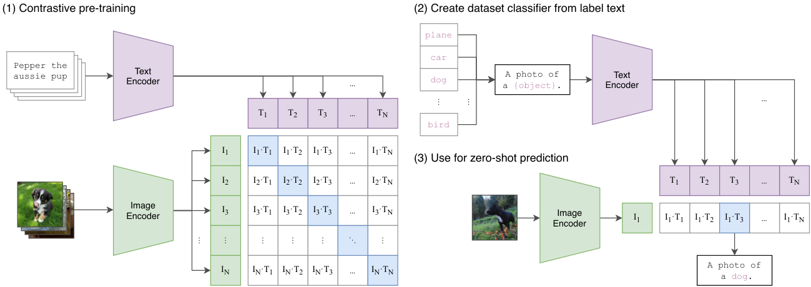</td><td valign="top" width="50%">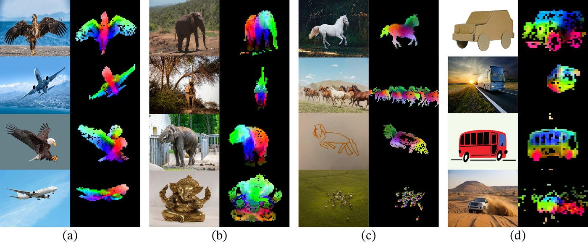</td></tr><tr><td valign="top"><b>Language-aligned.</b> CLIP puts an image and its caption in one space, so a class can be named instead of labeled. Radford et al., 2021.</td><td valign="top"><b>Self-supervised.</b> The first three components of DINOv2's features, with no labels, already separate parts. Oquab et al., 2023.</td></tr></table>

<table><tr><td valign="top" width="50%">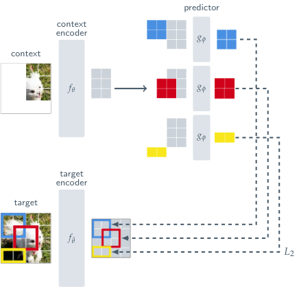</td><td valign="top" width="50%">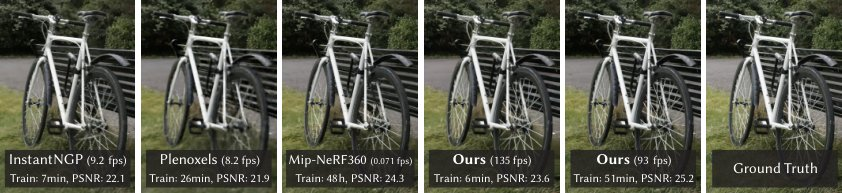</td></tr><tr><td valign="top"><b>Predictive.</b> I-JEPA predicts the representation of a masked region, never the pixels. Assran et al., 2023.</td><td valign="top"><b>Geometric.</b> 3D Gaussian Splatting holds a scene as explicit primitives that render in real time. Kerbl et al., 2023.</td></tr></table>

- There is no best one. Half the hub's world models start from a frozen DINOv2 because freezing it is cheap, not because it fits their task.
- The choice follows the need and the budget. Language-aligned to follow instructions, geometric to plan a grasp, predictive to anticipate, and a convnet when production data is small.
- Read a representation paper for the downstream task it was tested on. That is the job it is good for, and often the only one.

<pre>
<i>where we are</i>
<b>understand the field</b>
  <b>§1 what it is</b>         <b>the loop</b> · <b>embodiment</b>
  <b>§2 the anatomy</b>        <b>seven stages</b> · <b>sense</b> · <b>represent</b> · anticipate · decide · act · verify
                        adapt
  §3 toward production  what gets built · the missing part · build on today
<b>join the conversation</b>
  §4 read a paper       PACES · on one paper
  §5 the debates        the format · debate 1 · what to read · prompts
  §6 keep the hub alive a row, a cell, a column
  §7 my research
</pre>

### 2.3 Anticipate: think before you move

<table><tr><td valign="top" width="50%">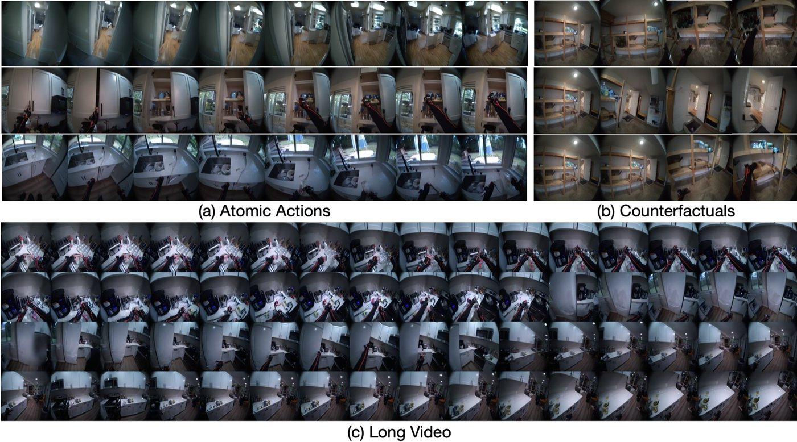</td><td valign="top" width="50%">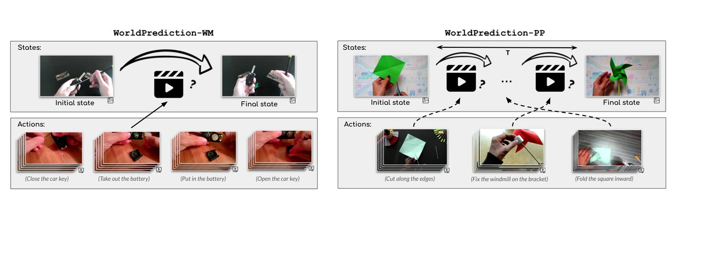</td></tr><tr><td valign="top"><b>A body's world model.</b> PEVA predicts first-person video from the wearer's own 3D pose, and can render the counterfactual move. Bai et al., 2025.</td><td valign="top"><b>The semantic side.</b> WorldPrediction tests whether a model can say which action took a scene from state A to state B, and in which order. 2025.</td></tr></table>

- People think before they move, and often run the counterfactual first: what fails if I slice the potato instead of dicing it. Physical AI needs the same stage.
- The text side reasons over steps and effects. Procedural reasoning and counterfactual reasoning are the search terms, and WorldPrediction benchmarks both.
- The vision side is the world model, a video generator rendering the action and its effect from the actor's viewpoint. PEVA for a body, V-JEPA 2 for a robot.
- A person and a robot follow the prediction differently. That difference is 2.4 and 2.5.

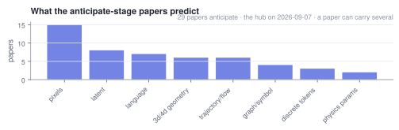

- 29 papers anticipate. 15 predict pixels, 8 a latent, 7 words. What the prediction is made of is an open choice, and it sets what 2.4 can do.
- Pixels are the easiest to check and the most expensive to plan in. A latent is cheap to plan in and cannot be looked at.

<table><tr><td valign="top" width="100%">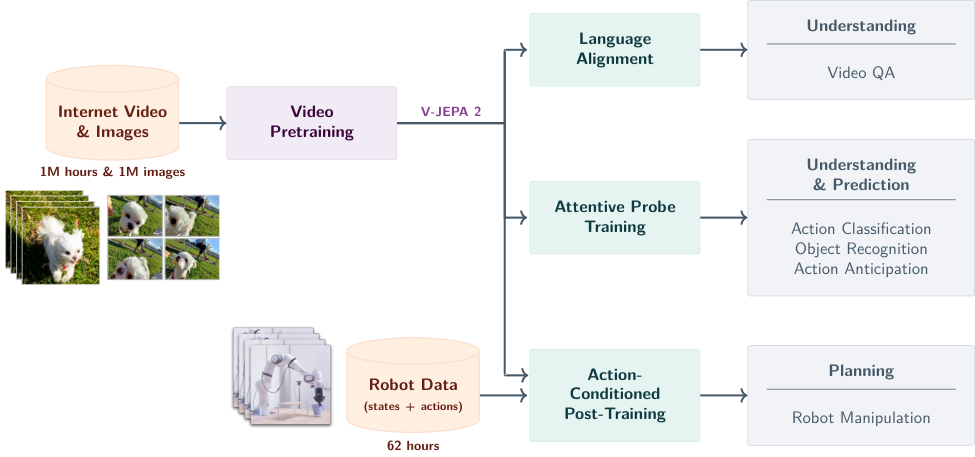</td></tr><tr><td valign="top"><b>Video in, robot out.</b> V-JEPA 2 learns from a million hours of internet video, then 62 hours of unlabeled robot video, then picks and places on an arm in a lab it never saw. Meta, 2025.</td></tr></table>

- Only the last 62 hours involve a robot. The planner samples actions and keeps the one whose predicted latent lands nearest the goal.
- Predicted futures still break physics where it can be measured. Text-to-video models fail most of PhyGenBench's 27 laws, and scale does not close the gap.

<pre>
<i>where we are</i>
<b>understand the field</b>
  <b>§1 what it is</b>         <b>the loop</b> · <b>embodiment</b>
  <b>§2 the anatomy</b>        <b>seven stages</b> · <b>sense</b> · <b>represent</b> · <b>anticipate</b> · decide · act · verify
                        adapt
  §3 toward production  what gets built · the missing part · build on today
<b>join the conversation</b>
  §4 read a paper       PACES · on one paper
  §5 the debates        the format · debate 1 · what to read · prompts
  §6 keep the hub alive a row, a cell, a column
  §7 my research
</pre>

### 2.4 Decide: pick one future, and say why

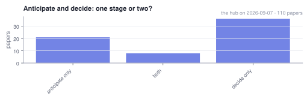

- Most of the time the two are one network. 8 papers do both explicitly, 36 decide with no separate prediction, and 21 predict without ever choosing.
- When they separate, anticipate generates futures and decide selects one. That is the boundary, and it is why the lecture keeps two subsections.
- The human embodiment forces the split. The person, not the model, executes, so the decision has to be handed over in a form they can check.

<table><tr><td valign="top" width="100%">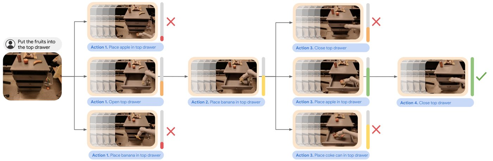</td></tr><tr><td valign="top"><b>Sample, score, choose.</b> Video Language Planning grows a tree of generated video futures and keeps the branch a value model scores highest. Du et al., 2023.</td></tr></table>

- Selection is a search over imagined outcomes. Video Language Planning searches a tree of generated clips, and V-JEPA 2 samples actions and picks by predicted cost.
- More compute buys a better plan in both, which is the argument for keeping anticipate and decide separable even when one network does both.

<b>a person</b>
<table><tr><td valign="top" width="50%">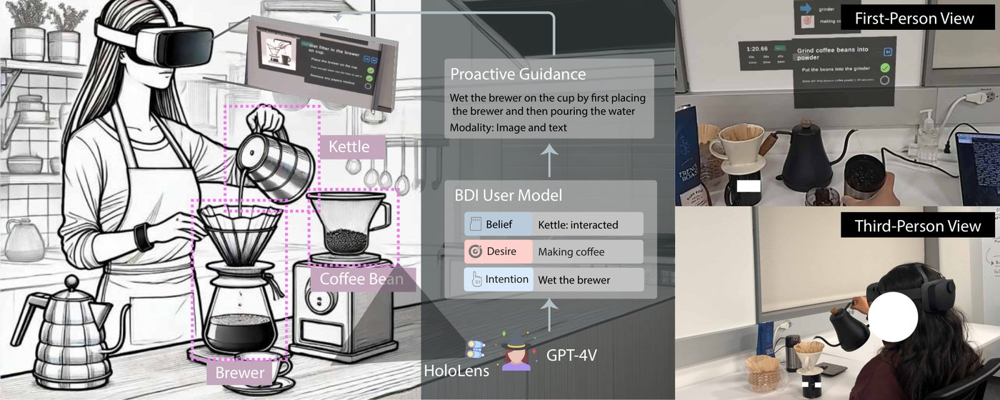</td><td valign="top" width="50%">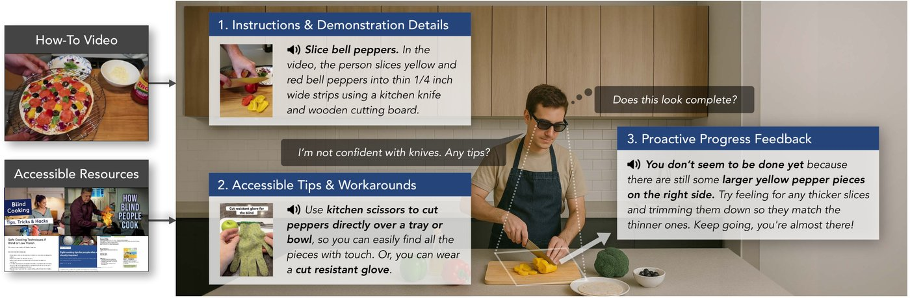</td></tr><tr><td valign="top"><b>When to speak.</b> Satori models what the person believes, wants and intends, and decides on its own when to show guidance. Li et al., 2024.</td><td valign="top"><b>What to say.</b> Vid2Coach turns a how-to video into instructions a blind cook can act on, with a completion check per step. Huh et al., 2025.</td></tr></table>

<table><tr><td valign="top" width="100%">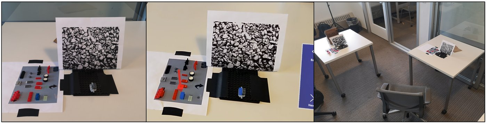</td></tr><tr><td valign="top"><b>How much to show.</b> AR guidance for assembly made workers 31% faster, and they made more errors. 2025.</td></tr></table>

- For a person, deciding includes what to say and when. Satori's authors call timing the hard problem, and the AR study shows more guidance is not better.
- Too much and the person is overwhelmed, too little and they distrust it. A chatbot's essay followed by three options is the virtual version of the same failure.
- The physical version has stakes. A step near fire, electricity or a patient needs a decision the person can check before acting, with the reason attached.

<pre>
<i>where we are</i>
<b>understand the field</b>
  <b>§1 what it is</b>         <b>the loop</b> · <b>embodiment</b>
  <b>§2 the anatomy</b>        <b>seven stages</b> · <b>sense</b> · <b>represent</b> · <b>anticipate</b> · <b>decide</b> · act · verify
                        adapt
  §3 toward production  what gets built · the missing part · build on today
<b>join the conversation</b>
  §4 read a paper       PACES · on one paper
  §5 the debates        the format · debate 1 · what to read · prompts
  §6 keep the hub alive a row, a cell, a column
  §7 my research
</pre>

### 2.5 Act: a person just acts, a robot has to be controlled

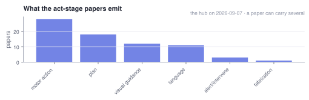

- For a person, act is the easy stage. Given a good decision, they do it. The system's act is an instruction, an image or an overlay.
- For a robot, act is control, the chosen plan turned into joint commands at tens of hertz. All of robot learning lives in the motor-action bar.

<pre>
   <b>2022</b>  Code as Policies       the language model writes the program that calls the controller
   <b>2022</b>  RT-1                   a transformer maps camera and instruction to discrete actions
   <b>2023</b>  Diffusion Policy · ACT actions as a denoised trajectory; commit to a chunk at a time
   <b>2023</b>  RT-2                   a VLM fine-tuned to emit actions as tokens: the first VLA
   <b>2024</b>  OpenVLA · π₀           an open 7B VLA; a flow-matching action head across bodies
   <b>2025</b>  GR00T N1 · π₀.₅        a slow reasoner over a fast actor; open-world generalization
   <b>2025–26</b>  Genie Envisioner · DreamZero   world action models: predict the video and the action together
</pre>

- Four branches compete: write the program, denoise the trajectory, emit action tokens from a VLM, or predict video and action together. No one knows yet which wins.
- Diffusion Policy beat the prior state of the art by 46.9% across 12 tasks. OpenVLA beat RT-2-X by 16.5 points with 7× fewer parameters.
- A world action model folds anticipate, decide and act into one network. DreamZero runs 14B parameters closed-loop at 7 Hz and generalizes twice as well as VLAs.

<b>a robot</b>
<table><tr><td valign="top" width="50%">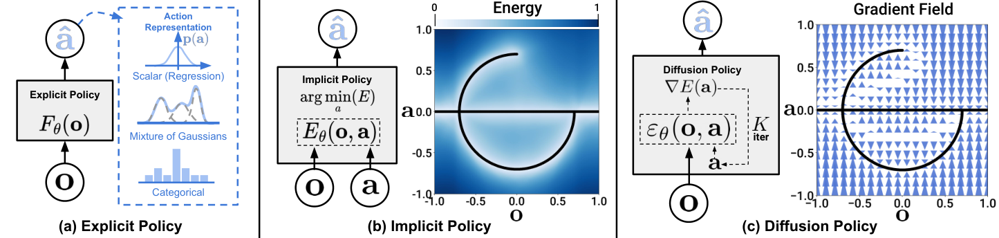</td><td valign="top" width="50%">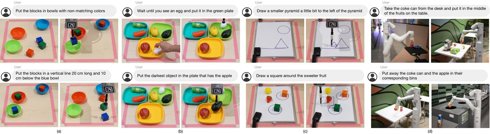</td></tr><tr><td valign="top"><b>Denoise the trajectory.</b> Diffusion Policy keeps the several right ways to do a task that a regression head averages away. Chi et al., 2023.</td><td valign="top"><b>Write the program.</b> In Code as Policies the plan is Python, so it can be read, composed and debugged. Liang et al., 2022.</td></tr></table>

<table><tr><td valign="top" width="100%">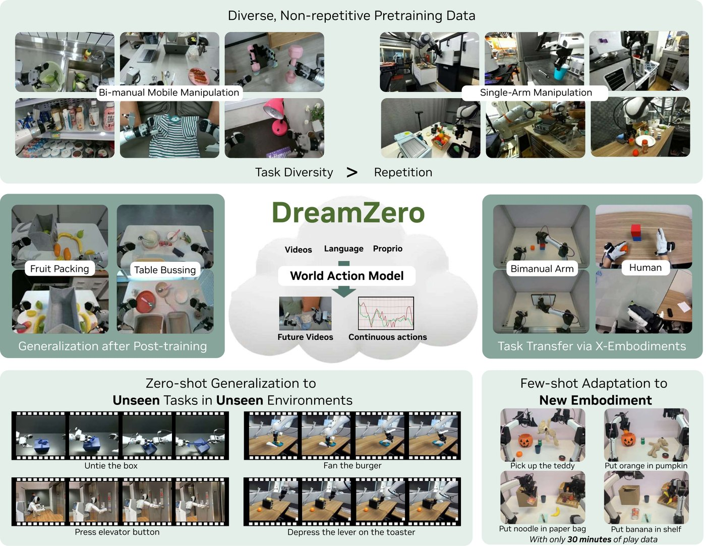</td></tr><tr><td valign="top"><b>Predict video and action.</b> DreamZero, a world action model on a video diffusion backbone, transfers from human video with 10 to 20 minutes of data. 2026.</td></tr></table>

- Each branch is a bet on what a policy should output: code, a trajectory, tokens, or a future. The bets are still open, and worth exploring.
- Push end to end far enough and represent goes in too. V-JEPA 2 plans in its own latent and never renders a pixel.

<pre>
<i>where we are</i>
<b>understand the field</b>
  <b>§1 what it is</b>         <b>the loop</b> · <b>embodiment</b>
  <b>§2 the anatomy</b>        <b>seven stages</b> · <b>sense</b> · <b>represent</b> · <b>anticipate</b> · <b>decide</b> · <b>act</b> · verify
                        adapt
  §3 toward production  what gets built · the missing part · build on today
<b>join the conversation</b>
  §4 read a paper       PACES · on one paper
  §5 the debates        the format · debate 1 · what to read · prompts
  §6 keep the hub alive a row, a cell, a column
  §7 my research
</pre>

### 2.6 Verify: close the loop on what happened

<b>a robot</b>
<table><tr><td valign="top" width="33%">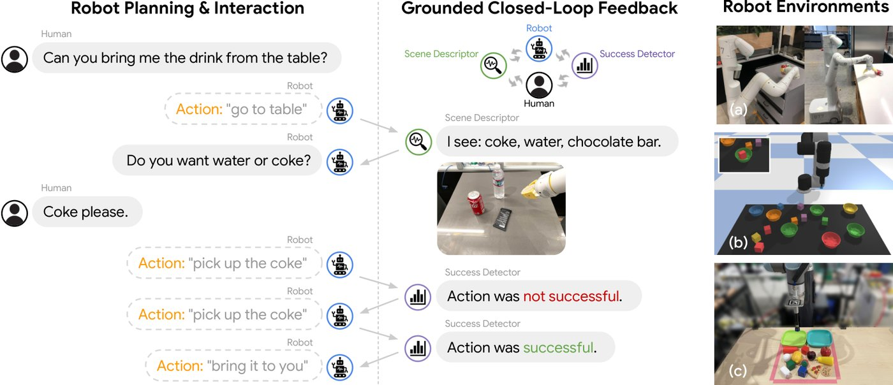</td><td valign="top" width="33%">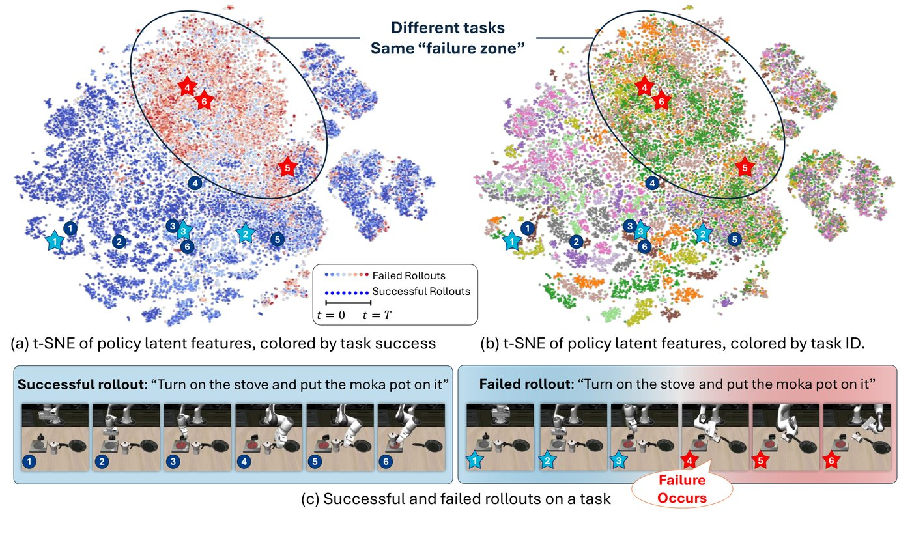</td><td valign="top" width="33%">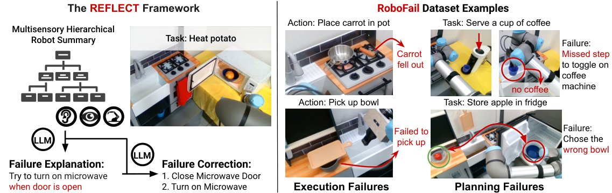</td></tr><tr><td valign="top"><b>Feed the outcome back.</b> Inner Monologue hands the planner a success flag, a scene description or a person's answer after every skill. Huang et al., 2022.</td><td valign="top"><b>Read failure off the policy.</b> SAFE finds a failure zone in a VLA's own features and alerts before the task is lost. Gu et al., 2025.</td><td valign="top"><b>Explain it.</b> REFLECT summarizes what the robot sensed and asks a language model why the task failed, then replans. Liu et al., 2023.</td></tr></table>

- Verify is what makes the next decision rest on what happened rather than on what was intended. Without it the loop is open, however good the policy.
- The robot side has had it since Inner Monologue, a check after every step and a replan. SAFE detects the failure and REFLECT explains it.

<b>a person</b>
<table><tr><td valign="top" width="33%">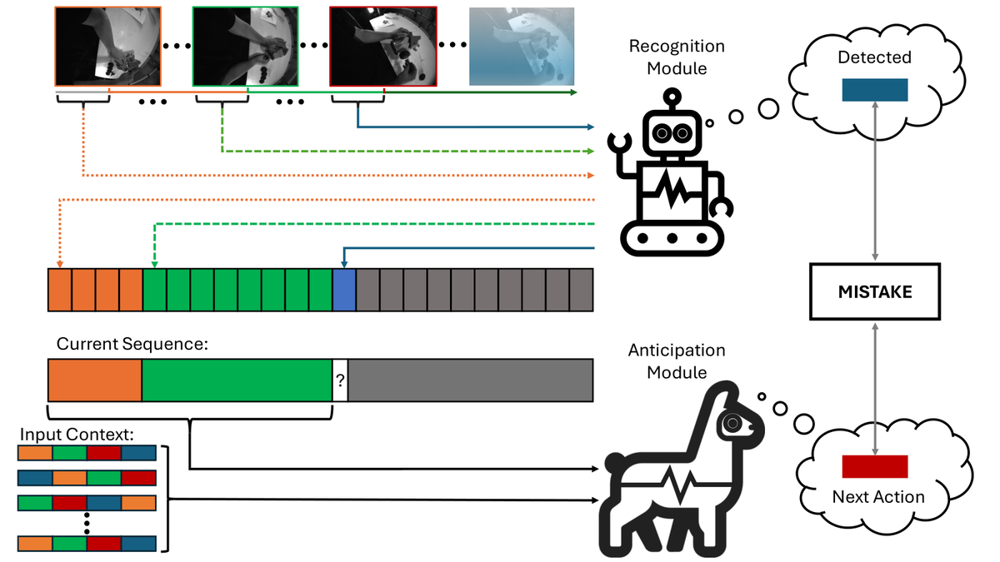</td><td valign="top" width="33%">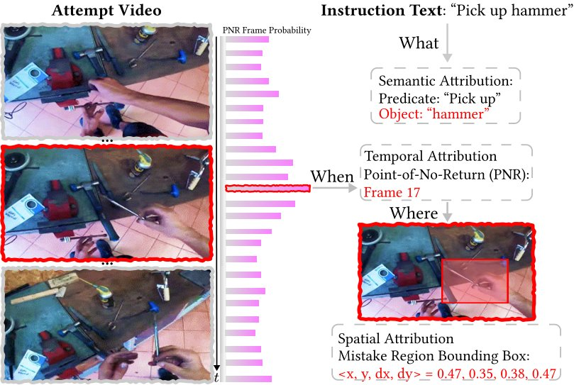</td><td valign="top" width="33%">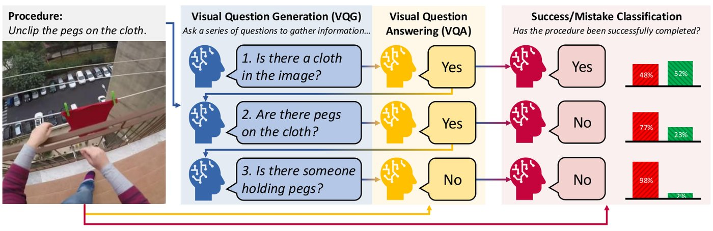</td></tr><tr><td valign="top"><b>Detect the mistake.</b> PREGO recognizes the current step, predicts what should come next, and flags the disagreement, trained on correct runs only. CVPR 2024.</td><td valign="top"><b>Attribute it.</b> Mistake Attribution says which part of the instruction was violated, the frame of no return, and where in the frame. 2025.</td><td valign="top"><b>Explain it.</b> Transparent PMD requires a rationale and scores whether the rationale entails the verdict. Storks et al., EMNLP 2025.</td></tr></table>

- The human side calls it mistake detection. The intervals are longer, a step rather than a motor command, and the verdict needs a reason the person will accept.
- The research has moved from a flag to an account of what was wrong, when it became irreversible, where in the frame, and why the system thinks so.
- The two literatures ask the same question at the same stage and barely cite each other.

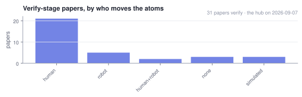

<table><caption>Who closes the loop, in the hub on 2026-09-07. A paper closes the loop when it consumes the effect of its own action at run time.</caption><thead><tr><th>embodiment</th><th>papers</th><th>close the loop</th><th>%</th></tr></thead><tbody><tr><td>Human</td><td>48</td><td>14</td><td>29</td></tr><tr><td>Robot</td><td>30</td><td>23</td><td>77</td></tr><tr><td>Human+Robot</td><td>6</td><td>5</td><td>83</td></tr><tr><td>None</td><td>23</td><td>2</td><td>9</td></tr><tr><td>Simulated</td><td>11</td><td>9</td><td>82</td></tr></tbody></table>

- 21 of the 31 verify papers watch a person. 5 watch a robot.
- 23 of the 30 robot papers consume the effect of their own action. 14 of the 48 human ones do. Most guidance systems emit an instruction and stop.
- A robot policy that never looked at the result would not get published. A guidance system that never does is the norm. That gap is a project.

<pre>
<i>where we are</i>
<b>understand the field</b>
  <b>§1 what it is</b>         <b>the loop</b> · <b>embodiment</b>
  <b>§2 the anatomy</b>        <b>seven stages</b> · <b>sense</b> · <b>represent</b> · <b>anticipate</b> · <b>decide</b> · <b>act</b> · <b>verify</b>
                        adapt
  §3 toward production  what gets built · the missing part · build on today
<b>join the conversation</b>
  §4 read a paper       PACES · on one paper
  §5 the debates        the format · debate 1 · what to read · prompts
  §6 keep the hub alive a row, a cell, a column
  §7 my research
</pre>

### 2.7 Adapt: better on the next attempt because of the last one

<table><tr><td valign="top" width="50%">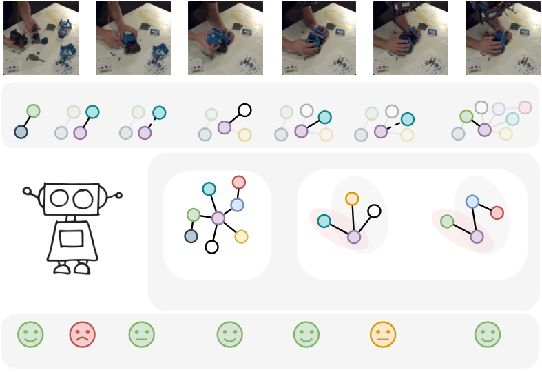</td><td valign="top" width="50%">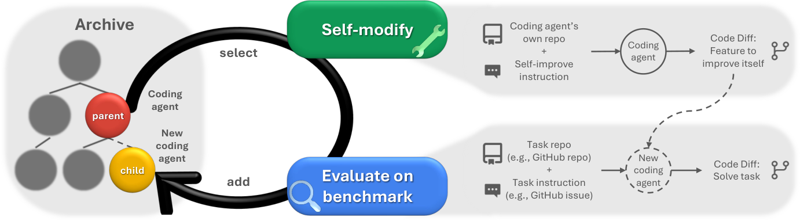</td></tr><tr><td valign="top"><b>In the physical world.</b> Every Mistake Counts keeps a graph of which parts fit and what must come first, and updates it as it watches. Ding et al., 2023.</td><td valign="top"><b>In code.</b> The Darwin Gödel Machine rewrites its own agent code and keeps the versions that score higher. Zhang et al., 2025.</td></tr></table>

<table><tr><td valign="top" width="100%">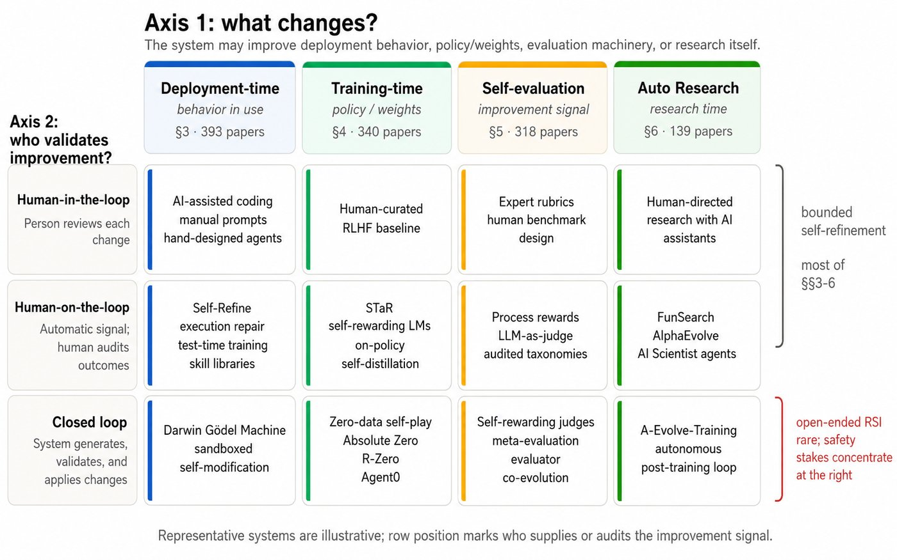</td></tr><tr><td valign="top"><b>The map.</b> A July 2026 survey of 1,250 papers sorts self-improvement by what changes and how closed the loop is. Most of it is bounded self-refinement.</td></tr></table>

- The old name is continual learning. The new one is self-evolving AI, and it covers the harness around the model as well as its weights.
- The frontier labs run it on coding agents, where the loop closes cheaply. The Darwin Gödel Machine and its relatives rewrite their own code and keep what scores.
- The same survey finds the open-ended version bounded on every measured axis, and MIT Technology Review's August 2026 read is that it is not coming quickly.
- Physical AI needs it too. A guidance system that changes its next instruction because of what the last one did is this stage, and the stage is empty.

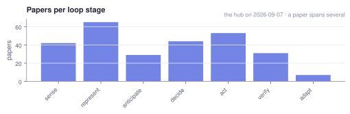

- 7 of 110 papers adapt. The field can tell that something went wrong and almost never learns from it while running.
- The exceptions are from 2023 and 2022. Every Mistake Counts updates its constraints as it watches, and Inner Monologue feeds the outcome back as text.

<pre>
<i>where we are</i>
<b>understand the field</b>
  <b>§1 what it is</b>         <b>the loop</b> · <b>embodiment</b>
  <b>§2 the anatomy</b>        <b>seven stages</b> · <b>sense</b> · <b>represent</b> · <b>anticipate</b> · <b>decide</b> · <b>act</b> · <b>verify</b>
                        <b>adapt</b>
  §3 toward production  what gets built · the missing part · build on today
<b>join the conversation</b>
  §4 read a paper       PACES · on one paper
  §5 the debates        the format · debate 1 · what to read · prompts
  §6 keep the hub alive a row, a cell, a column
  §7 my research
</pre>

<pre>
          the physical world, objects and the changes they undergo
                    │
          <b>2.1 sense</b> │                                       ▲
                    ▼                                       │
        ┌─ model it ───────────────────────────────┐        │
        │   <b>2.2 represent</b> ──► <b>2.3 anticipate</b>       │        │  the loop of §1, with the
        └────────────────────────┬─────────────────┘        │  stage each subsection
                                 │ <b>2.4 decide</b>               │  walks written onto it
        ┌─ change it ────────────▼─────────────────┐        │
        │   <b>2.5 act</b> ──► <b>2.6 verify</b> ──► <b>2.7 adapt</b>   ├────────┘
        └──────────────────────────────────────────┘
</pre>

## Toward production and real-world impact

### What gets built, and on which tasks

<table><caption>What a paper contributes, by the domain it works in. The hub on 2026-09-07; a paper can carry several of each.</caption><thead><tr><th>contribution</th><th>everyday</th><th>skill/sport</th><th>industrial</th><th>clinical</th><th>lab / sim</th><th>web-scale</th></tr></thead><tbody><tr><td>dataset</td><td>26</td><td>2</td><td>8</td><td>1</td><td>7</td><td>3</td></tr><tr><td>benchmark</td><td>29</td><td>1</td><td>7</td><td>1</td><td>9</td><td>2</td></tr><tr><td>method</td><td>52</td><td>4</td><td>12</td><td>2</td><td>40</td><td>17</td></tr><tr><td>system</td><td>11</td><td>1</td><td>2</td><td>1</td><td>10</td><td>1</td></tr><tr><td>analysis</td><td>9</td><td>1</td><td>5</td><td>2</td><td>4</td><td>1</td></tr><tr><td>survey</td><td>2</td><td>0</td><td>1</td><td>1</td><td>1</td><td>0</td></tr></tbody></table>

- 81 of 110 papers are methods, 32 datasets, 17 systems, 2 surveys. The community builds methods.
- 74 papers touch everyday tasks, 21 industrial, 6 clinical. Daily tasks are the proxy, because that is where the footage is.
- Daily tasks have reached systems tested on people (Vid2Coach, Satori, AROMA). Professional tasks are still at data and benchmarks (IndustReal, HoloAssist, Ego-EXTRA).

<pre>
<i>where we are</i>
<b>understand the field</b>
  <b>§1 what it is</b>         <b>the loop</b> · <b>embodiment</b>
  <b>§2 the anatomy</b>        <b>seven stages</b> · <b>sense</b> · <b>represent</b> · <b>anticipate</b> · <b>decide</b> · <b>act</b> · <b>verify</b>
                        <b>adapt</b>
  <b>§3 toward production</b>  <b>what gets built</b> · the missing part · build on today
<b>join the conversation</b>
  §4 read a paper       PACES · on one paper
  §5 the debates        the format · debate 1 · what to read · prompts
  §6 keep the hub alive a row, a cell, a column
  §7 my research
</pre>

### The missing part is data

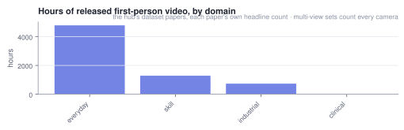

<table><caption>The datasets behind the bars, with each paper's own count. Assembly101's 513 hours are 12 views of 362 seven-minute sequences.</caption><thead><tr><th>dataset</th><th>hours</th><th>tier</th><th>note</th><th>source</th></tr></thead><tbody><tr><td>Ego4D</td><td>3670</td><td>everyday</td><td>unscripted daily life</td><td>arXiv 2110.07058</td></tr><tr><td>EgoDex</td><td>829</td><td>everyday</td><td>tabletop manipulation with hand tracking</td><td>arXiv 2505.11709</td></tr><tr><td>EPIC-KITCHENS-100</td><td>100</td><td>everyday</td><td>kitchens</td><td>arXiv 2006.13256</td></tr><tr><td>CaptainCook4D</td><td>94.5</td><td>everyday</td><td>recipes with induced errors</td><td>arXiv 2312.14556</td></tr><tr><td>HD-EPIC</td><td>41</td><td>everyday</td><td>kitchens with a digital twin</td><td>arXiv 2502.04144</td></tr><tr><td>HowToDIV</td><td>24</td><td>everyday</td><td>clips behind generated dialogues</td><td>arXiv 2508.11192</td></tr><tr><td>HOT3D</td><td>13.9</td><td>everyday</td><td>833 minutes of hand and object tracking</td><td>arXiv 2411.19167</td></tr><tr><td>EgoOops</td><td>6.8</td><td>everyday</td><td>text-following tasks with mistakes</td><td>arXiv 2410.05343</td></tr><tr><td>HUMOTO</td><td>2.2</td><td>everyday</td><td>mocap human-object interaction</td><td>arXiv 2504.10414</td></tr><tr><td>Ego-Exo4D</td><td>1286</td><td>skill</td><td>ego and exo cameras combined; 5035 takes</td><td>arXiv 2311.18259</td></tr><tr><td>Assembly101</td><td>513</td><td>industrial</td><td>12 views of toy-vehicle assembly; 362 sequences of 7 min</td><td>arXiv 2203.14712</td></tr><tr><td>HoloAssist</td><td>166</td><td>industrial</td><td>instructor talks a performer through a task</td><td>arXiv 2309.17024</td></tr><tr><td>Ego-EXTRA</td><td>50</td><td>industrial</td><td>expert plays the assistant</td><td>arXiv 2512.13238</td></tr><tr><td>IndustReal</td><td>5.8</td><td>industrial</td><td>84 assembly and maintenance sequences</td><td>arXiv 2310.17323</td></tr></tbody></table>

- About 4,800 hours of everyday life, 1,286 of skill from one dataset, 735 industrial, 513 of them twelve views of toy assembly, and nothing clinical.
- The professional end owns the value and the intellectual property. Hospitals and factories do not release footage, so the largest record of expert guidance is 50 hours.
- Impact in production is a data problem before a method problem. The routes are one-demonstration learning, synthetic data, or data that never leaves the site.

<pre>
<i>where we are</i>
<b>understand the field</b>
  <b>§1 what it is</b>         <b>the loop</b> · <b>embodiment</b>
  <b>§2 the anatomy</b>        <b>seven stages</b> · <b>sense</b> · <b>represent</b> · <b>anticipate</b> · <b>decide</b> · <b>act</b> · <b>verify</b>
                        <b>adapt</b>
  <b>§3 toward production</b>  <b>what gets built</b> · <b>the missing part</b> · build on today
<b>join the conversation</b>
  §4 read a paper       PACES · on one paper
  §5 the debates        the format · debate 1 · what to read · prompts
  §6 keep the hub alive a row, a cell, a column
  §7 my research
</pre>

### What you can build on today

<table><tr><td valign="top" width="50%">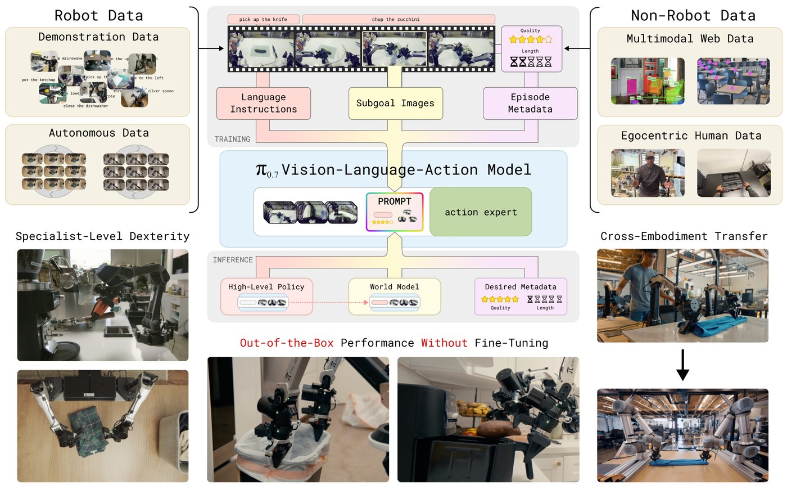</td><td valign="top" width="50%">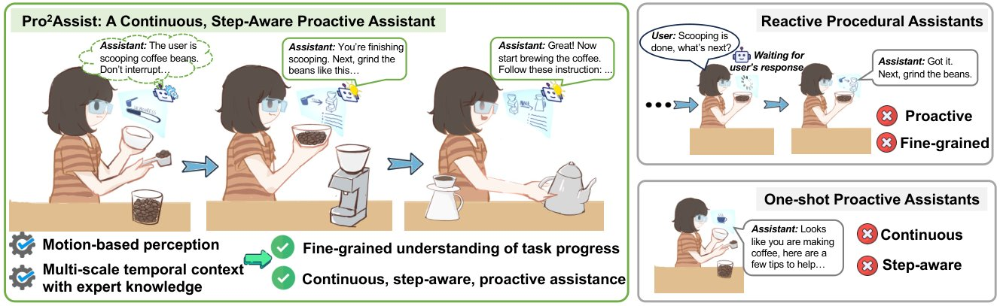</td></tr><tr><td valign="top"><b>For a robot, π₀.₇</b>, Physical Intelligence, April 2026. Follows instructions in kitchens it never saw and folds laundry on a robot that never trained on it. <a href='https://www.pi.website/blog/pi07'>blog</a> · <a href='https://arxiv.org/abs/2604.15483'>arXiv</a></td><td valign="top"><b>For a person, Pro²Assist</b>, May 2026. Tracks step progress from AR-glasses sensing and decides when to help, through a whole procedure. <a href='https://arxiv.org/abs/2605.04227'>arXiv</a></td></tr></table>

- Two links, one per embodiment, to the latest thing you can start from.
- Both are stacks of 2.1 to 2.5, and the robot one is a product. Neither adapts.

<pre>
<i>where we are</i>
<b>understand the field</b>
  <b>§1 what it is</b>         <b>the loop</b> · <b>embodiment</b>
  <b>§2 the anatomy</b>        <b>seven stages</b> · <b>sense</b> · <b>represent</b> · <b>anticipate</b> · <b>decide</b> · <b>act</b> · <b>verify</b>
                        <b>adapt</b>
  <b>§3 toward production</b>  <b>what gets built</b> · <b>the missing part</b> · <b>build on today</b>
<b>join the conversation</b>
  §4 read a paper       PACES · on one paper
  §5 the debates        the format · debate 1 · what to read · prompts
  §6 keep the hub alive a row, a cell, a column
  §7 my research
</pre>

## How to read a paper so you can argue about it

<pre>
   <b>PACES</b>            where it sits in the paper           what the hub records
   ─────            ──────────────────────────           ────────────────────
   Problem          the problem setting. Skip the        the function computed at inference:
                    intro, it is a long abstract         inputs and outputs, each with a
                                                         modality and a shape
   Approach         the method                           one or two sentences of intuition,
                                                         then the components
   Claims           the abstract, the contributions      the tldr: the claim, never the topic
                    list, the last paragraph of intro
   Evaluation       the experiments                      datasets and what was done to them,
                                                         metrics, baselines
   Substantiation   <b>your judgment</b> on whether E           the headline number, a confidence,
                    holds up C                           and why the paper earns a place
</pre>

- Reading is the least systematic thing most graduate students do, and the debates will show it.
- PACES is Jason's method: Problem, Approach, Claims, Evaluation, Substantiation, asked of every paper in that order ([the write-up](https://medium.com/@jasoncorso/how-to-read-conference-papers-fa78c75f78aa)).
- Skip the introduction and the related work on a first read. What is left is the problem, the method and the experiments, plus the claim and the verdict.

<pre>
<i>where we are</i>
<b>understand the field</b>
  <b>§1 what it is</b>         <b>the loop</b> · <b>embodiment</b>
  <b>§2 the anatomy</b>        <b>seven stages</b> · <b>sense</b> · <b>represent</b> · <b>anticipate</b> · <b>decide</b> · <b>act</b> · <b>verify</b>
                        <b>adapt</b>
  <b>§3 toward production</b>  <b>what gets built</b> · <b>the missing part</b> · <b>build on today</b>
<b>join the conversation</b>
  <b>§4 read a paper</b>       <b>PACES</b> · on one paper
  §5 the debates        the format · debate 1 · what to read · prompts
  §6 keep the hub alive a row, a cell, a column
  §7 my research
</pre>

### PACES on one paper

<table>
<thead><tr><th></th><th>PREGO, online mistake detection in procedural egocentric video (CVPR 2024)</th></tr></thead>
<tbody>
<tr><td>P</td><td>Online one-class mistake detection: decide, as each action ends, whether it
    was a mistake. Input is the video stream up to now. Output is a flag per action. Training
    sees correct executions only, because the ways a procedure can go wrong cannot be
    enumerated.</td></tr>
<tr><td>A</td><td>Recognize the current action from the stream, predict from a symbolic model
    of the procedure what should come next, and flag the disagreement.</td></tr>
<tr><td>C</td><td>The first online open-set procedural mistake detector, with two benchmarks
    adapted for the setting.</td></tr>
<tr><td>E</td><td>Assembly101-O and EPIC-Tent-O, remixes of existing datasets for the online
    setting. F1 and AUC. Baselines: supervised mistake classifiers and anomaly detection.</td></tr>
<tr><td>S</td><td>The "first" claim is a definition and holds by construction. The accuracy
    claim rests on two benchmarks the authors remixed and baselines they adapted, so check
    whether the baselines saw the same causal input. The follow-up, TI-PREGO, reports that
    per-frame evaluation is hard.</td></tr>
</tbody></table>

- The S row judges E against C and names the thing you would go and check.
- A debate side is that row, argued out loud.

<pre>
<i>where we are</i>
<b>understand the field</b>
  <b>§1 what it is</b>         <b>the loop</b> · <b>embodiment</b>
  <b>§2 the anatomy</b>        <b>seven stages</b> · <b>sense</b> · <b>represent</b> · <b>anticipate</b> · <b>decide</b> · <b>act</b> · <b>verify</b>
                        <b>adapt</b>
  <b>§3 toward production</b>  <b>what gets built</b> · <b>the missing part</b> · <b>build on today</b>
<b>join the conversation</b>
  <b>§4 read a paper</b>       <b>PACES</b> · <b>on one paper</b>
  §5 the debates        the format · debate 1 · what to read · prompts
  §6 keep the hub alive a row, a cell, a column
  §7 my research
</pre>

## How the debates work

<pre>
   before          two papers, read with PACES · one question prompt per paper
                        │
   in the room     side A, the claim holds ─────┐
                                                ├──►  what is the claim · does the evaluation
                   side B, it does not ─────────┘     substantiate it · is the method right
                        │
   after           the hub changes: a cell corrected, a why rewritten, a column argued
</pre>

- The debates re-run, in public, the reasoning that produced the hub's claims. Reasoning is the skill this course trains.
- Two papers. The sides argue the claim, its substantiation, the method.
- Write the five PACES rows for both papers before you pick a side.

<pre>
<i>where we are</i>
<b>understand the field</b>
  <b>§1 what it is</b>         <b>the loop</b> · <b>embodiment</b>
  <b>§2 the anatomy</b>        <b>seven stages</b> · <b>sense</b> · <b>represent</b> · <b>anticipate</b> · <b>decide</b> · <b>act</b> · <b>verify</b>
                        <b>adapt</b>
  <b>§3 toward production</b>  <b>what gets built</b> · <b>the missing part</b> · <b>build on today</b>
<b>join the conversation</b>
  <b>§4 read a paper</b>       <b>PACES</b> · <b>on one paper</b>
  <b>§5 the debates</b>        <b>the format</b> · debate 1 · what to read · prompts
  §6 keep the hub alive a row, a cell, a column
  §7 my research
</pre>

### Debate 1 · From virtual to physical AI

<pre>
                  the state                 the act                     the check
                  ─────────                 ───────                     ─────────
   virtual AI     a file, a page.           emit tokens. Undo is        the return value
                  fully readable            one keystroke               says what happened

   <b>physical AI</b>    seen through a camera     move something through      whether the world
                  on a head. Partial,       a body. Slow, and a cut     changed is a second
                  occluded, moving          does not undo               perception problem
</pre>

- The loop that changed the virtual world, think, act, read the result, repeat, breaks in three places once it has a body: the state, the act, the check.
- Two core papers, one per side. ReAct runs the loop in a house made of text, and Ego-Exo4D films 1,286 hours of skilled work to ask what a model must see.
- Three questions for the room: why physical AI beyond virtual, when it is needed and where the boundary sits, and what is technically different.

<table><tr><td valign="top" width="50%">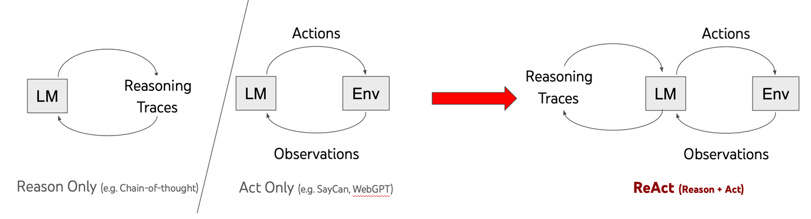</td><td valign="top" width="50%">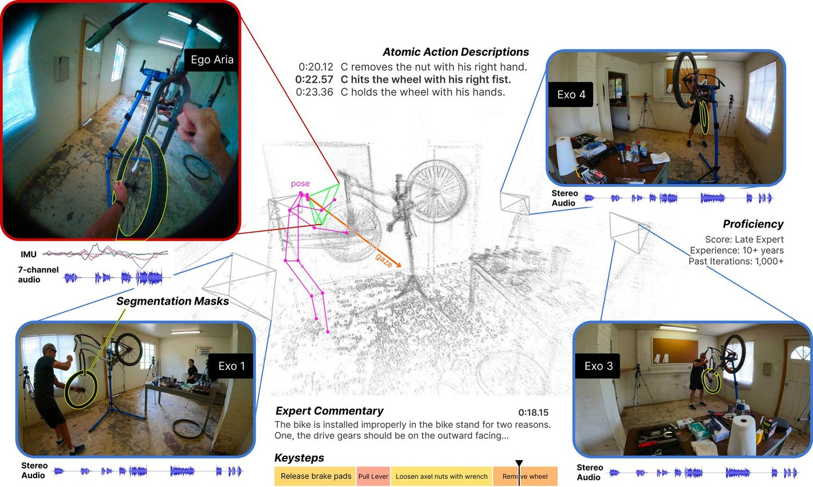</td></tr><tr><td valign="top"><b>ReAct</b>, ICLR 2023. A thought, an action and the observation alternate in one token stream. Every valid action works.</td><td valign="top"><b>Ego-Exo4D</b>, CVPR 2024. The same skilled activity from the doer's eyes and from outside, with an expert narrating the mistakes.</td></tr></table>

- ReAct uses three examples per task type and no training, and reaches 71% on ALFWorld with its best prompt, 57% on average, 34 points above the trained baseline.
- Ego-Exo4D has 5,035 takes from 740 participants in 123 scenes and 13 cities, and four benchmark families whose baselines the paper calls far from solved.
- Write the five PACES rows for both before you pick a side. The prompts below assume you did.

<pre>
<i>where we are</i>
<b>understand the field</b>
  <b>§1 what it is</b>         <b>the loop</b> · <b>embodiment</b>
  <b>§2 the anatomy</b>        <b>seven stages</b> · <b>sense</b> · <b>represent</b> · <b>anticipate</b> · <b>decide</b> · <b>act</b> · <b>verify</b>
                        <b>adapt</b>
  <b>§3 toward production</b>  <b>what gets built</b> · <b>the missing part</b> · <b>build on today</b>
<b>join the conversation</b>
  <b>§4 read a paper</b>       <b>PACES</b> · <b>on one paper</b>
  <b>§5 the debates</b>        <b>the format</b> · <b>debate 1</b> · what to read · prompts
  §6 keep the hub alive a row, a cell, a column
  §7 my research
</pre>

### Debate 1 · What to read

<table>
<thead><tr><th>core paper</th><th>its role here</th><th>read</th><th>pages</th></tr></thead>
<tbody>
<tr><td>ReAct: Synergizing Reasoning and Acting in Language Models. Yao et al., ICLR 2023.
    <a href="https://arxiv.org/abs/2210.03629">arXiv</a></td>
    <td>The loop with no body, in a house made of text</td>
    <td>Sections 1, 2 and 4, and one ALFWorld trajectory from Appendix D.2</td>
    <td>~8</td></tr>
<tr><td>Ego-Exo4D: Understanding Skilled Human Activity from First- and Third-Person
    Perspectives. Grauman et al., CVPR 2024.
    <a href="https://arxiv.org/abs/2311.18259">arXiv</a> ·
    <a href="http://ego-exo4d-data.org/">site</a></td>
    <td>The body, filmed from inside and outside at once, with an expert's verdict on it</td>
    <td>Section 1, Section 3 up to the participants, Section 4.1 on expert commentary, and
    Section 5 with its result tables</td>
    <td>~9</td></tr>
</tbody></table>

- ReAct is short and the trajectory in the appendix is the paper. Read one end to end and count how many observations the environment handed over for free.
- Ego-Exo4D is a dataset paper, so the evidence is in Section 5's tables. Read them asking how far each baseline is from a coach you would use.

<table>
<thead><tr><th>one paper per stage</th><th>why this one</th><th>read</th></tr></thead>
<tbody>
<tr><td>sense · SAM 2. Ravi et al., ICLR 2025.
    <a href="https://arxiv.org/abs/2408.00714">arXiv</a></td>
    <td>Object identity over time from a stream, the cheapest sensing primitive most
    pipelines in the hub rely on</td>
    <td>The model figure with the streaming memory, and the video results table</td></tr>
<tr><td>represent · DINOv2. Oquab et al., TMLR 2024.
    <a href="https://arxiv.org/abs/2304.07193">arXiv</a></td>
    <td>The frozen features half the hub's world models start from</td>
    <td>The data curation section and the first results table</td></tr>
<tr><td>anticipate · V-JEPA 2. Assran et al., 2025.
    <a href="https://arxiv.org/abs/2506.09985">arXiv</a></td>
    <td>A world model learned from a million hours of video that plans on a robot with
    62 hours of unlabeled robot video</td>
    <td>The overview figure, the action-conditioned section, and the real-robot table</td></tr>
<tr><td>decide · SayCan. Ahn et al., CoRL 2022.
    <a href="https://arxiv.org/abs/2204.01691">arXiv</a></td>
    <td>Language scores what is useful, a value function scores what is possible, and the
    ablation prices the body at 17 points of plan success</td>
    <td>The scoring rule and Table 2</td></tr>
<tr><td>act · π₀. Black et al., RSS 2025.
    <a href="https://arxiv.org/abs/2410.24164">arXiv</a></td>
    <td>The reference robot foundation model, a flow-matching action head on a VLM and one
    policy across single-arm, dual-arm and mobile platforms</td>
    <td>The model section and the laundry-folding evaluation</td></tr>
<tr><td>verify · PREGO. Flaborea et al., CVPR 2024.
    <a href="https://arxiv.org/abs/2404.01933">arXiv</a></td>
    <td>Online mistake detection trained on correct executions only, the setting the human
    side of verify reports against</td>
    <td>The two-branch figure and the online protocol. §4 of this lecture has its PACES</td></tr>
<tr><td>adapt · Inner Monologue. Huang et al., CoRL 2022.
    <a href="https://arxiv.org/abs/2207.05608">arXiv</a></td>
    <td>The outcome fed back to the planner as text, 50% to 75% with the loop closed, and one
    of seven hub papers that adapt at all</td>
    <td>Method, experiments and the limitations paragraph</td></tr>
</tbody></table>

- Seven papers, one per stage, each the one to cite if you could cite only one. Skim the figure and the main table of each.
- Every one is in the hub with its PACES already written. Disagree with a cell there and that is a contribution, see §6.

<table>
<thead><tr><th>talk</th><th>why</th><th>where</th></tr></thead>
<tbody>
<tr><td>Fei-Fei Li, Justin Johnson and Ben Mildenhall with Martin Casado, "The Race to Build
    World Models for AI", The a16z Show, 4 Sep 2026, 45 min</td>
    <td>The day after World Labs launched Atlas: why predicting a new view of a scene might be
    to spatial intelligence what next-token prediction was to language, and why robotics is
    data-bound</td>
    <td><a href="https://podcasts.apple.com/us/podcast/fei-fei-li-the-race-to-build-world-models-for-ai/id842818711?i=1000787830626">Apple Podcasts</a></td></tr>
<tr><td>Karol Hausman, CEO of Physical Intelligence, "Why Robots Still Struggle With Simple
    Tasks", The Generalist, 17 Mar 2026</td>
    <td>The robot side from the company that ships π₀: what a robot foundation model is, and
    what still breaks</td>
    <td><a href="https://www.generalist.com/p/karol-hausman-physical-intelligence">The Generalist</a></td></tr>
<tr><td>Kristen Grauman, keynote at ECCV 2026, Thu 10 Sep 2026, 15:00 CEST</td>
    <td>The human side from Ego-Exo4D's lead: an AI guide that learned from video, anticipates
    the effect of your action, and tells you what to change. If you cannot attend, her 2025
    talk covers the same program</td>
    <td><a href="https://eccv.ecva.net/virtual/2026/invited-talk/6075">ECCV</a> ·
    <a href="https://www.youtube.com/watch?v=ggJOYPdwJt8">2025 talk</a></td></tr>
</tbody></table>

- Three voices, one per week night. Li for world models, Hausman for the robot, Grauman for the person.
- Listen for the boundary. Each of them says where their approach stops working, and that sentence is debate material.

<pre>
<i>where we are</i>
<b>understand the field</b>
  <b>§1 what it is</b>         <b>the loop</b> · <b>embodiment</b>
  <b>§2 the anatomy</b>        <b>seven stages</b> · <b>sense</b> · <b>represent</b> · <b>anticipate</b> · <b>decide</b> · <b>act</b> · <b>verify</b>
                        <b>adapt</b>
  <b>§3 toward production</b>  <b>what gets built</b> · <b>the missing part</b> · <b>build on today</b>
<b>join the conversation</b>
  <b>§4 read a paper</b>       <b>PACES</b> · <b>on one paper</b>
  <b>§5 the debates</b>        <b>the format</b> · <b>debate 1</b> · <b>what to read</b> · prompts
  §6 keep the hub alive a row, a cell, a column
  §7 my research
</pre>

### Debate 1 · Prompts

Each prompt is a motion one side defends, the evidence either side can reach for from the
readings, and the question that settles it. On each paper the three follow PACES: the claim,
its substantiation, the approach. The last three are about the field.

<blockquote><b>R1 · ReAct, the claim</b> 
<b>Motion.</b> ALFWorld is a physical task with the physics deleted, and that deletion is why ReAct works.
</blockquote>
<table><tr><td valign="top" width="50%"><b>for</b> The environment hands over the three things the figure above says the body breaks. The state arrives as a sentence, every valid action succeeds, and the episode ends with a symbolic check. Remove any one and 71% says nothing about a kitchen.</td><td valign="top" width="50%"><b>against</b> ALFWorld keeps the part of the problem a language model solves: where a desk lamp is likely to be and what to do next. SayCan's ablation prices that prior at 17 points of plan success, and it is the prior every physical planner in the hub inherits.</td></tr></table>

Settle it. Map each free thing to a physical number. The state: SayCan's 84% falls to 67% without the value function. The act: ACT needs action chunking to reach 80 to 90% from ten minutes of demonstrations. The check: Inner Monologue's 50% falls to 12.5% when a person disturbs the scene.

<blockquote><b>R2 · ReAct, the substantiation</b> 
<b>Motion.</b> The claim rests on the average of six prompts, 57%, and the paper leads with the best, 71%.
</blockquote>
<table><tr><td valign="top" width="50%"><b>for</b> Prompt selection is a hyperparameter the baseline did not get to tune. A trained agent reports one number, and a prompted one reports the best of six.</td><td valign="top" width="50%"><b>against</b> Both numbers beat the trained baseline by a wide margin, 34 points on the paper's own headline, and the average is the number the paper reports in its table.</td></tr></table>

Settle it. Rerun the comparisons with the average. Which survive, and does the +34 headline?

<blockquote><b>R3 · ReAct, the approach</b> 
<b>Motion.</b> Interleaving a thought and an action retrieves a plan from pretraining. It does not reason.
</blockquote>
<table><tr><td valign="top" width="50%"><b>for</b> Three examples per task type and no training. Performance tracks how familiar the environment's vocabulary is, and a household is the most familiar place on the internet.</td><td valign="top" width="50%"><b>against</b> The thoughts change with the observation, which retrieval would not. ReAct-IM, the variant with Inner Monologue's fixed feedback format and no free-form thought, does worse.</td></tr></table>

Settle it. Design the experiment that separates the two. Swap the object names for nonsense words and predict whether the loop still closes.

<blockquote><b>E1 · Ego-Exo4D, the claim</b> 
<b>Motion.</b> Skill is visible only from both views at once: a model trained on the ego view alone cannot learn what the expert commentary points at.
</blockquote>
<table><tr><td valign="top" width="50%"><b>for</b> The commentary talks about posture, force and rhythm, which the head camera cannot see on its own body. The ego-exo relation family is the least solved of the four benchmarks.</td><td valign="top" width="50%"><b>against</b> Every guidance system in the hub runs on one camera at test time, the one on the head. If the outside view is needed to learn, it has to be distilled away, and the paper does not show that transfer.</td></tr></table>

Settle it. Find the benchmark where the outside view is present at training and absent at test. If the paper never runs it, say what it would take to.

<blockquote><b>E2 · Ego-Exo4D, the substantiation</b> 
<b>Motion.</b> 1,286 hours substantiate a dataset claim. The skill-learning claim rests on the baselines, and they are far from usable.
</blockquote>
<table><tr><td valign="top" width="50%"><b>for</b> The paper calls itself a foundational dataset and reports its baselines across four families as far from solved, cross-view tasks least of all.</td><td valign="top" width="50%"><b>against</b> A dataset paper is substantiated by what gets built on it. ExpertAF and SkillFormer already estimate proficiency and generate feedback from it, and both are in the hub.</td></tr></table>

Settle it. Take the proficiency-estimation table. Is the best number above a majority-class guess by more than two annotators disagree with each other?

<blockquote><b>E3 · Ego-Exo4D, the approach</b> 
<b>Motion.</b> Breadth, eight scenario types in thirteen cities, was the wrong way to spend 1,286 hours. Depth on one skill would have produced a usable coach sooner.
</blockquote>
<table><tr><td valign="top" width="50%"><b>for</b> A coach needs many examples of the same mistake. 5,035 takes over eight domains is a few hundred takes per skill and a handful per mistake type.</td><td valign="top" width="50%"><b>against</b> Failing to generalize across sites is the failure mode of every earlier egocentric dataset, and Ego4D's lesson. Depth on one skill in one city would repeat it.</td></tr></table>

Settle it. Read the takes-per-scenario distribution in Section 3.2 and decide whether you would train a bike-repair coach on that count.

<blockquote><b>F1 · why physical AI at all</b> 
<b>Motion.</b> A virtual agent with a camera feed is already physical AI. The body adds nothing in kind, only in degree.
</blockquote>
<table><tr><td valign="top" width="50%"><b>for</b> The industry definition is sensors plus a model. RT-2 gets web knowledge into a gripper by writing actions as tokens, the same trick that makes a chatbot.</td><td valign="top" width="50%"><b>against</b> Sutton's in-principle case: a model with no goal and no ground truth is never surprised. The check is a second perception problem: 98% on the brick, 40% on the state of the assembly (LEGO Co-builder).</td></tr></table>

Settle it. Name one capability a physical agent can have that no virtual agent can have in principle, and one that is only a matter of scale.

<blockquote><b>F2 · when it is needed, and where the boundary sits</b> 
<b>Motion.</b> Most of the time words are enough. The loop earns its cost in three cases and not otherwise.
</blockquote>
<table><tr><td valign="top" width="50%"><b>for</b> A recipe is text, and people cook from it. AR guidance made assemblers 31% faster and made them make more errors.</td><td valign="top" width="50%"><b>against</b> When the person cannot read the state: Vid2Coach, blind cooks, 58.5% fewer errors. When the timing matters: Satori's authors call deciding when to speak the hard problem. When a mistake is expensive: the professional end of §3.</td></tr></table>

Settle it. Draw a two-by-two: the state readable by the person or not, a mistake cheap or expensive. Place ReAct, Ego-Exo4D's coaching, Vid2Coach and a surgical assistant in it.

<blockquote><b>F3 · what is technically different</b> 
<b>Motion.</b> The three breaks, the state, the act, the check, are each a perception problem in disguise.
</blockquote>
<table><tr><td valign="top" width="50%"><b>for</b> The state is seen through a moving camera and third-person detectors collapse from it (Ego-HOIBench). The check is perception again: 98% against 40%.</td><td valign="top" width="50%"><b>against</b> The act break is control, not perception. ALOHA's action chunking exists because errors compound across steps, and a cut does not undo. No camera fixes that.</td></tr></table>

Settle it. For each break, name the hub paper that attacks it and the number that says how far it is from solved.

<pre>
<i>where we are</i>
<b>understand the field</b>
  <b>§1 what it is</b>         <b>the loop</b> · <b>embodiment</b>
  <b>§2 the anatomy</b>        <b>seven stages</b> · <b>sense</b> · <b>represent</b> · <b>anticipate</b> · <b>decide</b> · <b>act</b> · <b>verify</b>
                        <b>adapt</b>
  <b>§3 toward production</b>  <b>what gets built</b> · <b>the missing part</b> · <b>build on today</b>
<b>join the conversation</b>
  <b>§4 read a paper</b>       <b>PACES</b> · <b>on one paper</b>
  <b>§5 the debates</b>        <b>the format</b> · <b>debate 1</b> · <b>what to read</b> · <b>prompts</b>
  §6 keep the hub alive a row, a cell, a column
  §7 my research
</pre>

## Keep the hub alive together

<pre>
   read a paper ──► PACES + 13 columns ──► a row ──► the counts move ──► a gap closes or opens
                                                            │
   a debate ends ──► a wrong cell · a weak why · a value with no paper ──► an edit
</pre>

- The hub outlives the course by design, with no schedule, lecture numbers or assignments in it. What it needs from you is rows and arguments.
- A row is a paper read with PACES and tagged on the 13 columns. No cell runs past two sentences, and no number comes from outside the paper.
- A cell is a wrong number, a tldr that names the topic instead of the claim, or a tag too generous. Every correction counts.
- A column is a vocabulary value with no paper in it. Find the paper or delete the value, because the build fails on an empty one.

<pre>
<i>where we are</i>
<b>understand the field</b>
  <b>§1 what it is</b>         <b>the loop</b> · <b>embodiment</b>
  <b>§2 the anatomy</b>        <b>seven stages</b> · <b>sense</b> · <b>represent</b> · <b>anticipate</b> · <b>decide</b> · <b>act</b> · <b>verify</b>
                        <b>adapt</b>
  <b>§3 toward production</b>  <b>what gets built</b> · <b>the missing part</b> · <b>build on today</b>
<b>join the conversation</b>
  <b>§4 read a paper</b>       <b>PACES</b> · <b>on one paper</b>
  <b>§5 the debates</b>        <b>the format</b> · <b>debate 1</b> · <b>what to read</b> · <b>prompts</b>
  <b>§6 keep the hub alive</b> <b>a row, a cell, a column</b>
  <b>§7 my research</b>
</pre>

That is the whole lecture. The field is a loop whose last two stages are nearly empty, and
the hub is the map of it. PACES reads one paper, the debates read two, and the hub is what
stays after the semester.

## My Research
